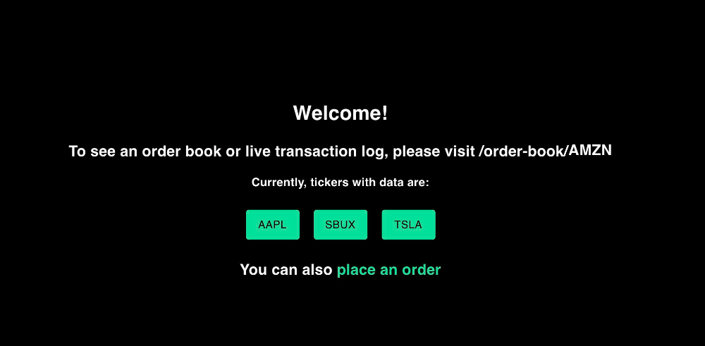
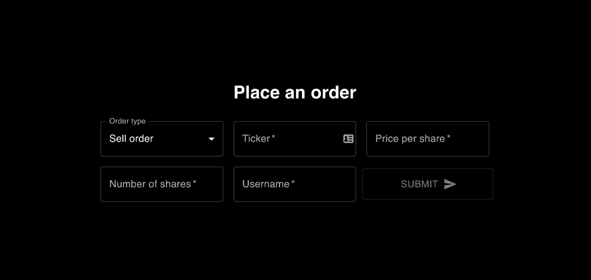

# Marketplace (Order Book)

An order book maintains all active orders for a security, and matches buy/sell (or bid/ask) orders if there is a suitable match. Here's my quick and dirty attempt at it.





## Features:
- Users can place buy or sell orders via the order page
- Orders are matched via a FIFO algorithm (loosely based on reading I did [here](https://www.amazon.com/Algorithmic-Trading-Practitioners-Jeffrey-Bacidore/dp/0578715236/ref=sr_1_4?dchild=1&keywords=algorithmic+trading&qid=1621740058&s=books&sr=1-4) and [here](https://en.wikipedia.org/wiki/Order_matching_system))
- Users can watch the order book for any security, which updates live as new orders are placed and cleared
- Additionally, there is a running log under the order book that describes all the transactions that have occured since the user has arrived at the page
- Order book data is persisted
- There is a front-end for users to interact via a UI, but also an API for folks who want to programatically hook in

## Technologies used:
- MongoDB for storing transaction data (this is connected to a remote MongoDB Atlas instance, so no need for any local setup)
- Flask
- React
- websockets/REST APIs

## Highlights:
- First time using a lot of these technologies, definitely not the cleanest code but I had a lot of fun doing it
- Every order is placed into a stack (ascending stack for asks and descending stack for bids). These lists are always maintained in order, therefore we can use binary search/insert operations, which help performance a lot. MongoDB's document style data maintainence ensures we won't run into page fragmentation or expensive sorts like we would in SQL DBs.
- There is some light client side validation on the orders page
- There are some rough unit tests for the matching algorithm and list insert maintainence

## Areas for growth:
- More tests
- Front end is quite disorganized, especially with styles and classes
- Better config, the Mongo DB Atlas URL is bare in the code right now
- There are some abstraction breaks on the server side too
- Front end needs a real server, not the hacky hook based display
- Better validation needed throughout app
- Have to figure out how to get the front-end onto Heroku, the [back-end works just fine](http://ak-marketplace-server.herokuapp.com/)
- Can iterate on data model to support other types of orders (like market orders)
- File structure should be cleaner, lacks direction

## Run it yourself:
This should be as simple as
```
# pull down the repo
git clone git@github.com:akuchibotla/marketplace.git

# set up virtual env (optional)
cd marketplace/api
python3 -m venv venv
source venv/bin/activate

# install python requirements
pip3 -r requirements.txt

# install JS requirements
cd ../marketplace-client
yarn install

# open a new terminal tab for back-end
# navigate to the same dir
yarn start-api

# go back to original terminal tab and start client
yarn start

# that's it! no need for a mongoDB instance since it's connected to a remote store
# navigate to localhost:3000 and follow instructions
```

## API endpoints
### Gets the order book for a specific security
```
GET /order-book/<security>
```
Responds with
```
{
  "bids": [{
    "price": 600.0,
    "volume": 20,
    "username": "zain",
    "timestamp": "2021-05-23 02:55:22.963856"
  },
  {
    "price": 600.0,
    "volume": 200,
    "username": "zain",
    "timestamp": "2021-05-23 09:39:22.234567"
  },
  {
    "price": 599.99,
    "volume": 5,
    "username": "harry",
    "timestamp": "2021-05-24 03:00:30.543569"
  }],
  "asks": [{
    "price": 601.00,
    "volume": 250,
    "username": "yas",
    "timestamp": "2021-05-21 02:55:22.963856"
  }]
}
```

### Gets a list of security tickers that have an order book open (even if the order book is empty)
```
GET /securities
```

### Places an order for a security
```
POST /order-book/order/<security>
```
with the following required payload
```
{
  "order_type": <str: "buy" or "sell">,
  "price": <float>,
  "volume": <int>,
  "username": <str>
}
```
