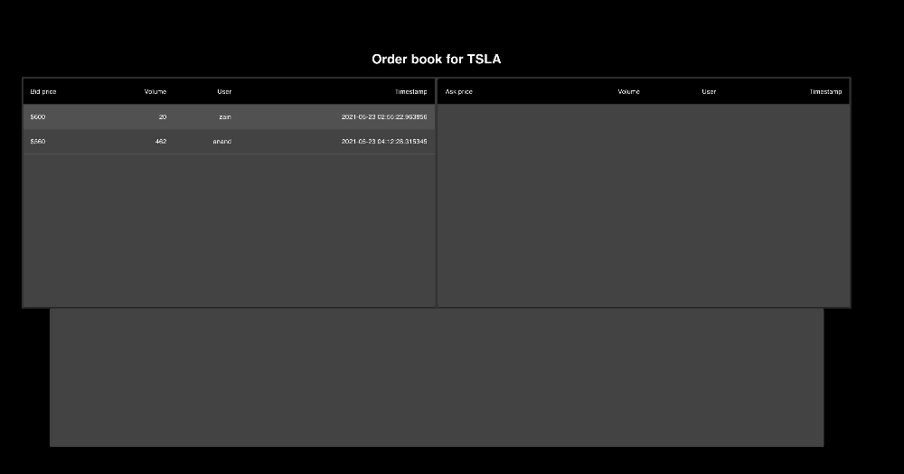

# Marketplace (Order Book)

An [order book](https://en.wikipedia.org/wiki/Order_book) maintains all active buy/sell orders for a security. Bids are ranked from highest bid to lowest bid, asks are ranked from lowest ask to highest ask. They are also ranked secondarily by the time the order was placed. An order book matches any buy/sell orders if there is an overlap between the bid and ask prices. Orders can be either completely cleared or partially cleared depending on the order volume. When an order is cleared, an order book should emit the clearing event to all interested parties. Here's my quick and dirty attempt at it.

#### This is the page you are greeted to at http://localhost:3000/


#### You can place an order for any ticker, not just the ones shown above. All tickers with order books will show up on the home page.


#### This is the order book, which updates live when new orders arrive. Bid/asks are ranked by price and order time. When an order is cleared, you receive a transaction log entry below the order book



## Features
- Users can place buy or sell orders via the order page
- Orders are matched via a FIFO algorithm (loosely based on reading I did [here](https://www.amazon.com/Algorithmic-Trading-Practitioners-Jeffrey-Bacidore/dp/0578715236/ref=sr_1_4?dchild=1&keywords=algorithmic+trading&qid=1621740058&s=books&sr=1-4) and [here](https://en.wikipedia.org/wiki/Order_matching_system))
- Users can watch the order book for any security, which updates live as new orders are placed and cleared
- Orders can either be completely cleared or partially cleared depending on the available interest volume
- Additionally, there is a running log under the order book that describes all the transactions that have occured since the user has arrived at the page
- Order book data is persisted
- There is a front-end for users to interact via a UI, but also an API for folks who want to programatically hook in

## Technologies used
- MongoDB for storing transaction data (this is connected to a remote MongoDB Atlas instance, so no need for any local setup)
- Flask
- React
- websockets/REST APIs

## Highlights
- First time using a lot of these technologies!
- Every order is placed into a priority list/queue (ascending list for asks and descending list for bids). These lists are always maintained in order, therefore we can use binary search/insert operations, which help performance for inserts. We always peek the top of each list to determine if there's a bid/ask match, and keep popping until there are no more matches. MongoDB's document style data maintainence ensures we won't run into page fragmentation or expensive sorts like we would in SQL DBs.
- Developers can easily plug in different DBs (SQL or not) as long as they implement the interface
- Developers can plug & play different order matching algorithms
- There is some light client side validation on the orders page
- There are some rough unit tests for the matching algorithm and order insert operations

## Future improvements
- More tests
- Logging, especially error logging
- Front end is quite disorganized, especially with styles and classes
- Better config, the Mongo DB Atlas credential is visible in the code right now (but it's just a sandbox server)
- There are some abstraction breaks on the server side too
- Front end needs a real server, not the hacky hook based display
- Better validation needed throughout app
- Have to figure out how to get the front-end onto Heroku, the [back-end API works just fine](http://ak-marketplace-server.herokuapp.com/order-book/TSLA)
- Can iterate on data model to support other types of orders (like market orders)
- In a real distributed highly trafficked environment, we'd need to implement some sort of row-locking and take general concurrency considerations into account (perhaps SQL with ordered indices is a better option since it's ACID compliant?)
- Real order books keep track of all transaction history, should be an easy add in the future
- File structure should be cleaner, lacks direction

## Run it yourself
This should be as simple as
```
# pull down the repo
git clone git@github.com:akuchibotla/marketplace.git

# set up virtual env (optional)
cd marketplace/api
python3 -m venv venv
source venv/bin/activate

# install python requirements
pip3 -r requirements.txt

# install JS requirements
cd ../marketplace-client
yarn install

# open a new terminal tab for back-end
# navigate to the same dir
yarn start-api

# go back to original terminal tab and start client
yarn start

# that's it! no need for a mongoDB instance since it's connected to a remote store
# navigate to localhost:3000 and follow instructions
```

## API endpoints
### Gets the order book for a specific security
```
GET /order-book/<security>
```
Responds with
```
{
  "bids": [{
    "price": 600.0,
    "volume": 20,
    "username": "zain",
    "timestamp": "2021-05-23 02:55:22.963856"
  },
  {
    "price": 600.0,
    "volume": 200,
    "username": "zain",
    "timestamp": "2021-05-23 09:39:22.234567"
  },
  {
    "price": 599.99,
    "volume": 5,
    "username": "harry",
    "timestamp": "2021-05-24 03:00:30.543569"
  }],
  "asks": [{
    "price": 601.00,
    "volume": 250,
    "username": "yas",
    "timestamp": "2021-05-21 02:55:22.963856"
  }]
}
```

### Gets a list of security tickers that have an order book open (even if the order book is empty)
```
GET /securities
```

### Places an order for a security
```
POST /order/<security>
```
with the following required payload
```
{
  "order_type": <str: "buy" or "sell">,
  "price": <float>,
  "volume": <int>,
  "username": <str>
}
```

## Websockets
### Emits order book updates
```
wss: <url>/order-book
event: order_book_update
message: {
  "bids": [
    {
      price: 404.33
      timestamp: "2021-05-23 07:25:29.264548"
      username: "zain"
      volume: 10
    },
    ...
  ]
  "asks": [
    {
      price: 404.35
      timestamp: "2021-05-23 04:18:25.802930"
      username: "harry"
      volume: 650
    },
    ...
  ],
}
```

### Emits order match events
```
wss: <url>/order-book
event: order_match_event
message: [
  {
    price: 50.45,
    volume: 50,
    security: "TSLA",
    payee: "doger",
    payer: "elon",
    timestamp: "2021-05-23 04:18:25.802930"
  },{
    price: 50.44,
    volume: 500,
    security: "TSLA",
    payee: "larry",
    payer: "elon",
    timestamp: "2021-05-23 04:18:25.802930"
  }
]
```
